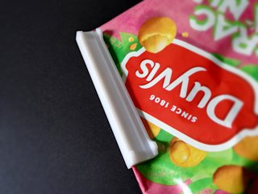
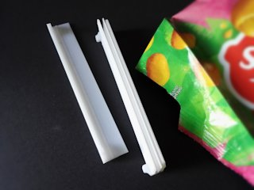
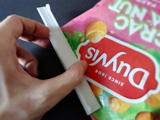
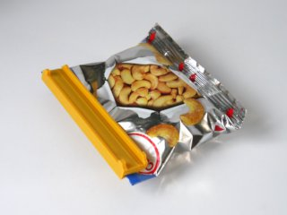
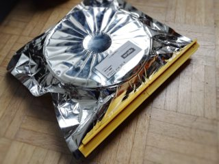
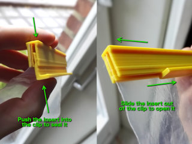

# Bag sealing clip (customizable)
*3D printable customizable bag sealing clip/clamp (formerly thing:2627442)*

### License
[Creative Commons - Attribution - Share Alike](https://creativecommons.org/licenses/by-sa/4.0/)

### Gallery

[🔎](images/sealer1.jpg) [🔎](images/sealer2.jpg) [🔎](images/sealer3.jpg) [🔎](images/sealer4.jpg) [🔎](images/sealer5.jpg)

## Description and Instructions

This is a two-piece clip to seal bags hermetically (under ideal circumstances). It can be used to seal bags of food and can even turn disposable filament packaging into resealable airtight bags. The latter is especially interesting if your filament came in mylar bags, because those are much better at keeping out moisture than plain plastic bags and it is a pity to simply throw them away. Although some manufacturers offer zip-lock plastic bags with their filament, non-metallic plastic bags will slowly but certainly transfer moisture to the inside and you will need to refresh desiccant more often.

The clip has two gaps, one narrow gap with a little zig-zag in which the bag should be inserted, and one wider gap for an insert (the clip has an extra ridge at this side). By pushing the insert into the clip, it clamps the bag shut. See the [video](https://youtu.be/knHa7uq_Qmk) for an example. You can use this on a cleanly cut bag without needing to fold it, but easiest is to fold the bag and slide the clip over the fold (see photos).

[🔎](images/instructions.jpg) 

To open the clip, slide out the insert and pull the clip off the bag.

You can create clips in two ways:
1. The recommended way is to [use OpenSCAD's Customizer](https://www.dr-lex.be/3d-printing/customizer.html) to create a new model from scratch. This offers maximal configurability and produces models that require the lease material and print time. You can opt to make the model with nubs that make it easier to open, and it will also have chamfered corners at one side that make it easier to insert a bag.
2. The fast and crude way: take one of the provided 10 mm STL models in the `examples` folder, and scale it in the X direction to the desired length, using your slicer program or a 3D editor. (Eg. for a 6cm clip, scale X to 600%.) This method is quick and easy but the result will be crude and you won't have the advantages of models made in Customizer.

To determine what gap width works best for a particular bag, you can print and test a few small test clips, and then make a larger clip for the one that clamps the bag well without being difficult to remove. If you have accurate calipers or a micrometer and your printer is well-calibrated, you can make a good guess at the optimal gap width by adding 0.5 mm to the thickness of the bag (folded or not, depending on how you want to seal it). You probably shouldn't go below a 0.8 mm gap though.

### Printing

I usually print these at 0.2 mm layers, with 25% infill (although there isn't much solid space to fill in anyhow).

Print with at least 2 perimeters and a good number of top and bottom layers.

If your printer is not large enough to print a single clip for a large bag, just print two and mount them side-by-side (see photos of filament bag). Very long clips are too unwieldy anyway. Tip: to allow to combine two separate clips into one rigid unit, make them in different lengths (at least 20 mm difference) and use the shorter insert in the longer clip and vice versa. Then the piece of insert sticking out can be used to connect with the other clip.

These work in any material although **PETG** is the filament of choice due to its flexibility and durability. PLA will provide a stiff clip, but it does tend to bend over time and lose some of its springiness (especially in warmer environments). It also has a higher risk of breaking especially after it has absorbed some moisture. ABS is somewhere in between PETG and PLA when it comes to stiffness and durability.

### Post-printing

Be sure to cut any stringing that may be present in the gaps, such that they are not obstructed. You may want to apply a little sanding to the nubs to make them more comfortable to use.

Before using the clip, push in the insert and slide it out a few times to make it work smoother. If you want to make it even easier to open the clip, apply a very small amount of silicone oil to the insert.

## Updates

### 2018/05/21
Added the option to include ‘nubs’ in the model that make it easier to push open the clip. Also added a chamfer to the corners to make it much easier to insert the bag into the clip.

### 2018/11/25
Reduced material usage for the insert. The old beefier model can still be obtained by enabling the ‘Heavy duty’ option. Also minor tweaks to the profile shapes.

### 2020/05/23
Slightly reduced height of the insert to save on material and print time (you still get the original height when enabling the ‘heavy duty’ option). Also further removed some redundant material on the side of the clip.

## Tags
`airtight`, `bag`, `bag_clip`, `clamp`, `clip`, `customizable`, `openscad`, `resealable`, `seal`, `sealer`
